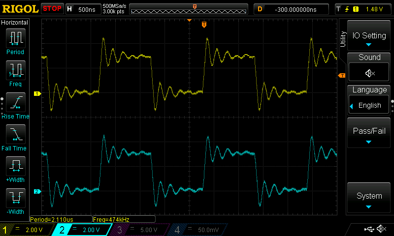

# 00_core_clock

In this demo, we will setup clock configurations. Also leds on the board has been setup so we could measure core clock. While loop in _coreClockTest takes 48 clock cycles so frequency of led blink should be 500Hz.

Figure1: Implementation of SystemInit function.

## Test

Figure2: Expected 500kHz. Got 474kHz, close enough. Deviation could be result of using HSI or oscillope is not calibrated.
