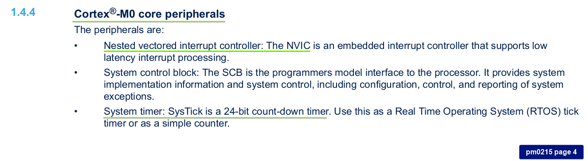
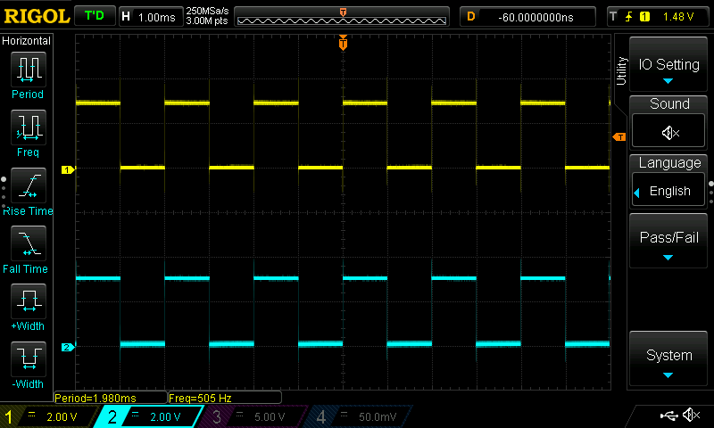

# 01_systick

This demo implements interrupt of systick timer. Interrupt occurs every 1 millisecond.

  
Figure 1: See _systick_init function how it is implemented.

## Test
  
Figure 2: Systick interrupt handler occurs every 1 ms and toggles led pins.