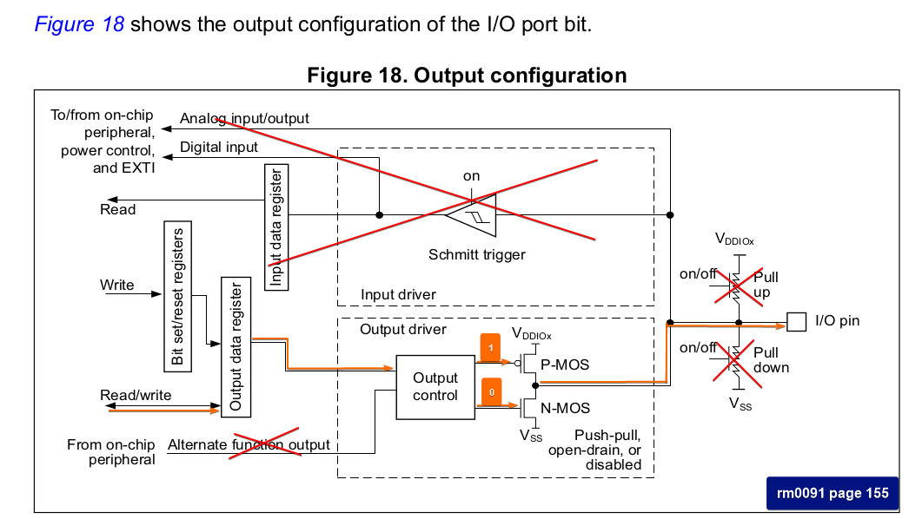
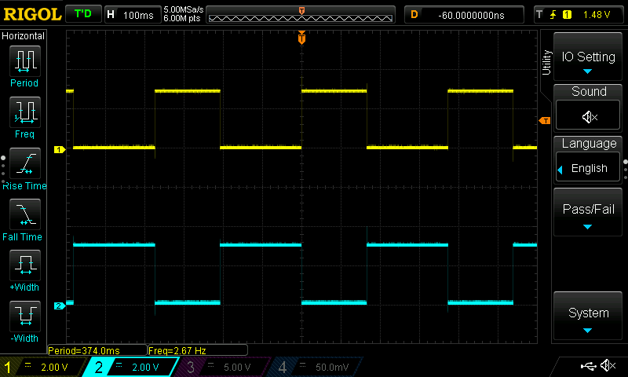

## 02_gpio_out

This demo implements LEDs configuration on the board. There are two leds; blue and yellow.

  
Figure 1: See _bsp_led_init function how it is implemented. Unused hardware crossed with red lines. Orange lines explains how we control pins.

## Test
  
Figure 2: PC8 value toggled in main while loop. PC9 is set to opposite of PC8.