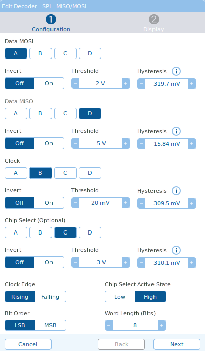
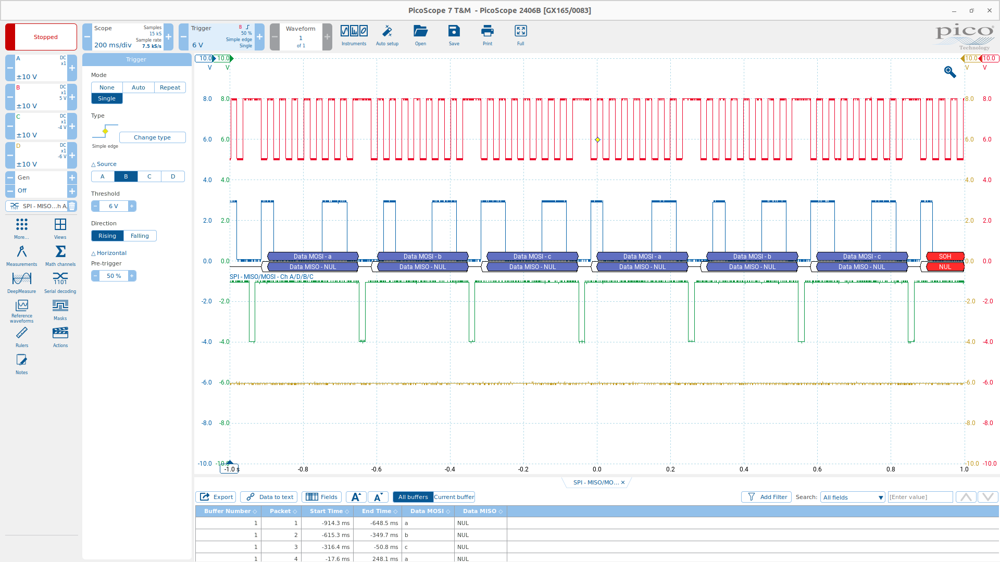

## 03_spi_bit_bang

This demo implements simplest SPI bit bang. Configuration:
* STM32 is Master
* PC7, chip select, active high, PicoScope chC
* PC8, clock, rising edge, PicoScope chB
* PC9, master out slave input, PicoScope chA
* Bit order LSB

Since there is no slave, MISO reading is not implemented.

## Test
  
Figure 1: Configuration of PicoScope 7

  
Figure 2: Embedded abc :). When chip select was not implemented, it was not reliable. I think it was losing one spi clock cycle then everything becomes garbage.

## Abbreviations and Acronyms
|Short form|Description|
|-|-|
|CS|Chip Select|
|MISO|Master Input Slave Output|
|CLK|Clock|
|MOSI|Master Output Slave Input|