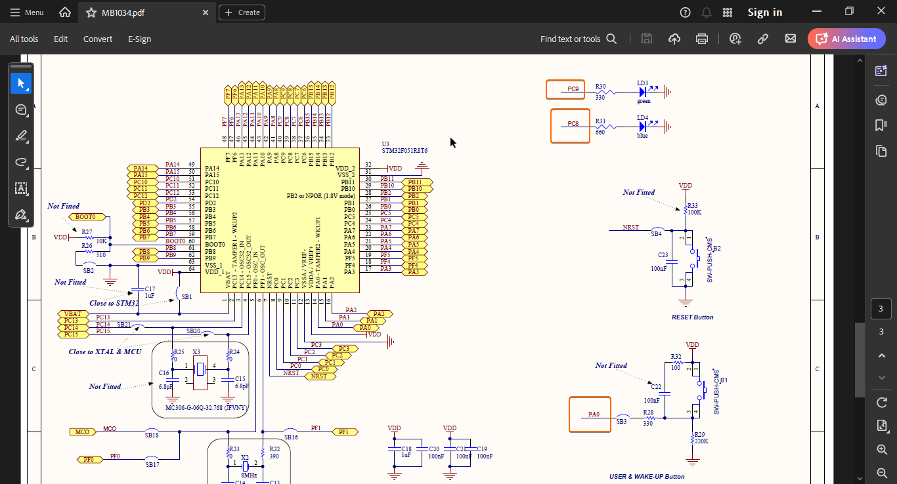
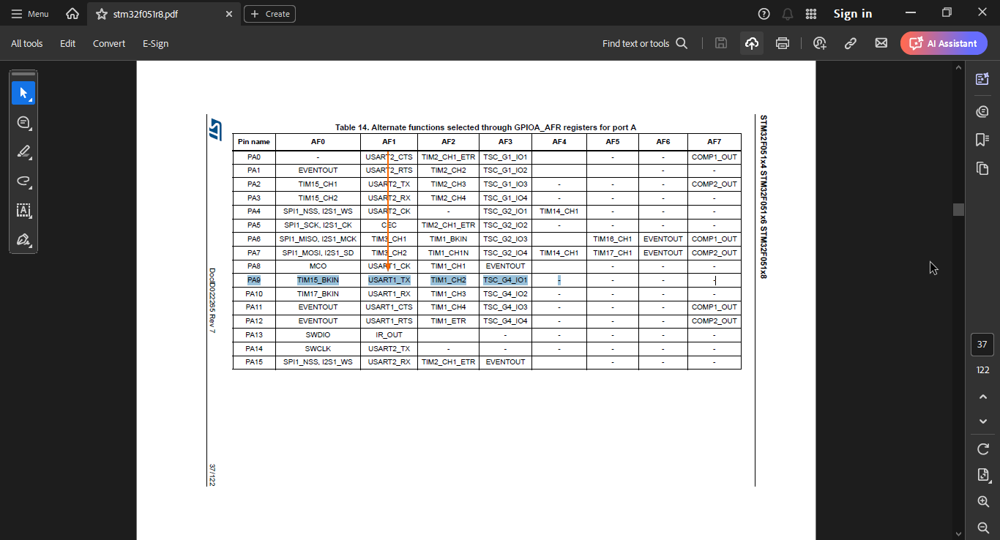
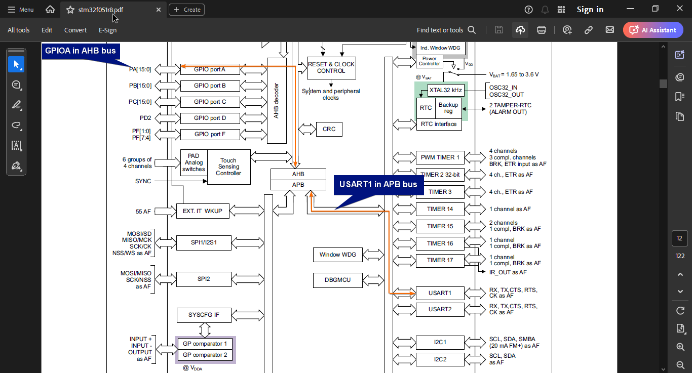
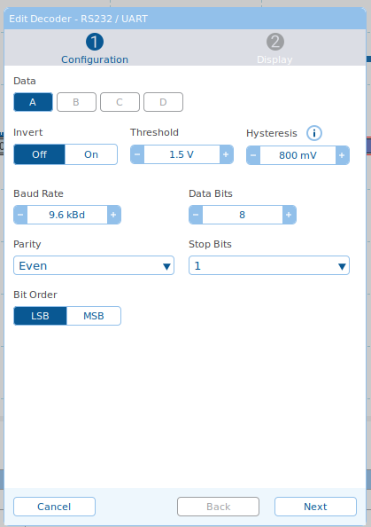
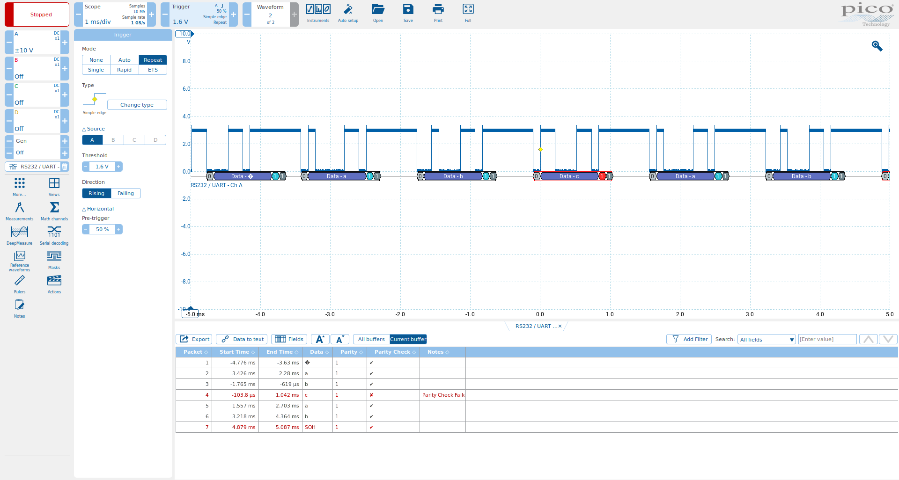

## 04_uart

In this demo USART1 Tx configured in UART mode. See the configuration parameremeters in Figure PicoScopeCfg.  
Steps:
* We need to find empty pin available with USART capability. Open stm32f051r8.pdf and search USART. I just choosed first pin with USART_Tx capability which is PA9.
* Lets check if pin is already in use.
  
Figure UsedPins: PC8, PC9, PA0 is used. PA9 is free.
* Learn PA9 alternate function number from datasheet.
  
Figure GpioAlternateFunction
* Learn buses of peripherals from datasheet.
  
* As usual detailed register descriptions are learned from RM0091. See source code for details.

## Test
  
Figure PicoScopeCfg: Configuration of PicoScope 7

  
Figure PicoScopeLog: Embedded abc :)

## Abbreviations and Acronyms
|Short form|Description|
|-|-|