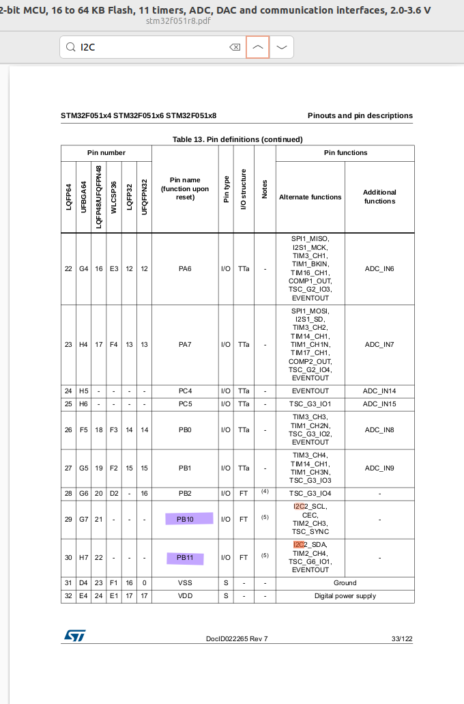

# 05_i2c

This is a demo for pushing data to I2C network. No external pull up resistor are required. This demo uses STM32's internal pull up resistor. Internal pull up resistor may not be enough for real world applications, see PicoScopeLog. The clock signal signal high is never reached VCC but since I am using picoscope, it is able to decode. STM32 is the master. Used pins:
* PB10 I2C2_SCL
* PB11 I2C2_SDA
* PB12 Fake Slave. Connect this to I2C2_SDA.

## Steps
1. Choose a pin with I2C which is not already in use.
  
2. Learn alternate function  
  
3. Learn the bus
  
4. Read reference manual I suggested first functional description. Then you could continue reading what registers does. See _i2c2_periph_init what you need for minimum implementation.
  

## Note
Here is a good video how I2C protocols work.
https://www.youtube.com/watch?v=CAvawEcxoPU&t=14s. It will explain you how _fake_slave function works.

## Test
  
Figure PicoScopeCfg: Configuration of PicoScope 7

  
Figure PicoScopeLog: Embedded abc :)

## Abbreviations and Acronyms
|Short form|Description|
|-|-|
|SDA|Serial Data Line|
|SCL|Serial Clock Line|