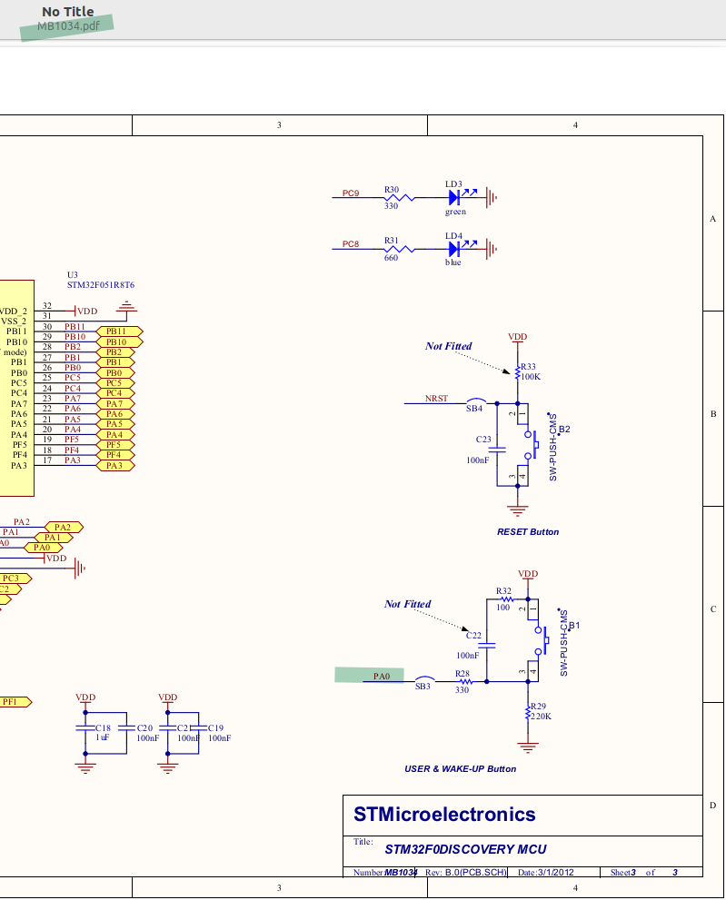

# 06_gpio_in

This demo implements reading of a button. Board leds are on by default, when user presses button leds are turned off.

  
Explanation:
* Open board schematic to find the pin.
* By default button pin pulled down to ground. When user presses the button; it will be pulled up.

## Note
Since board does not have external capacitor for debouncing, it should be handled in software.

## Abbreviations and Acronyms
|Short form|Description|
|-|-|