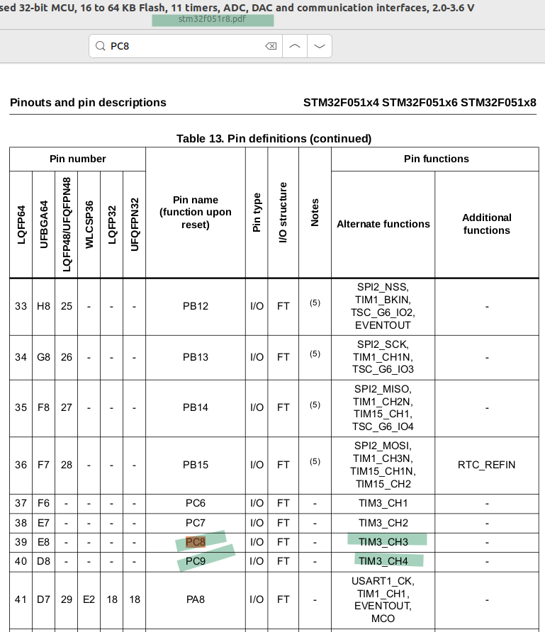

# 07_pwm

This implementation demonstrates simple heart beat of two leds on board.

  
Figure Pins: Lets use led pins to make pwm output

  
Figure Clock: Explanation of clocks

  
Figure Init: Explanation of _pwm_periph_init function

## Abbreviations and Acronyms
|Short form|Description|
|-|-|
|PWM|Pulse Width Modulation|